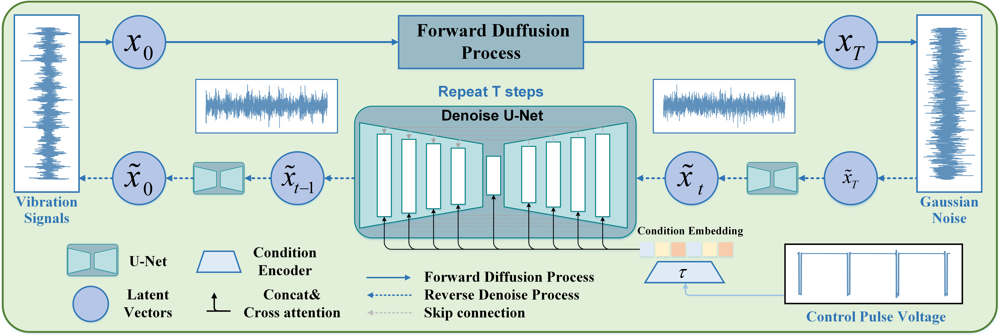

## Generating HSR Bogie Vibration Signals via Pulse Voltage-Guided Conditional Diffusion Model

--------------------
This repo contains the official implementation for the paper ["Generating HSR Bogie Vibration Signals via Pulse Voltage-Guided Conditional Diffusion Model"](https://ieeexplore.ieee.org/document/10740529).

### Introduction

<div align="justify"> We propose the pulse Voltage-Guided Conditional Diffusion Model (VGCDM). VGCDM incorporates pulse voltage as control signals by cross-attention to ensure the alignment of vibration with voltage signals, achieving high-quality vibration generation. Solely straightforward sampling of control voltages can ensure the efficient transformation from Gaussian Noise to vibration signals whether under steady or time-varying scenarios.



To validate the effectiveness, we conducted two case studies using SQ bearings dataset and high-simulation HSR bogie bearings dataset. The results of our experiments unequivocally confirm that VGCDM outperforms other generative models, achieving the best RSME, PSNR, and FSCS, showing its superiority in conditional HSR bogie vibration signal generation.</div>

### How to run code

-------------------------------------
#### Dependencies
Run the following to install a subset of necessary python packages for our code.

```
pip install -r requirements.txt
```

#### Usage
Directly run ```main.py``` can train the model and print the evaluate results once using the right data input. Notice!!!, for the original data, ```dataframe.csv``` are used to record the data direction. So if you want to revise code for your own dataset, please redefine from two aspects 1) Your dataset input direction 2) Model's parameter.

##### Dataset setting

For example, for SQ dataset input from ```dataset/SQ.py```, the input data comes from 
```
ori_root = '/home/lucian/Documents/datas/Graduate_data/SQdata/dataframe.csv' ## dataframe.csv record the direction of data
ori_csv_pd = pd.read_csv(ori_root) ### read as pd
labels_dict = create_labels_dict(state='inner3',datanum=100) ### setting dict to choose data, e.g. inner fault 3, every file sample 100 samples
out=filter_df_by_labels(ori_csv_pd, labels_dict) ## choose part of pd from dataframe.csv
label_index='rpm' ### use rpm to slice data
```
For original ```dataframe.csv```, it looks like

| path  | rpm     | state      |
|-----------------------------------------------------|---------|------------|
| XXXX/XXXX/XXX.txt                                           | 19      | normal     |
| XXXX/XXXX/XXX.txt | 29      | inner2     |
| XXXX/XXXX/XXX.txt | 39      | outer3     |


For your dataset, make sure your input settings are similar to ```dataset/SQ.py```. Where data refers to vibration and auxiliary refers to voltage. Labels are usually used as indicators and are not used as inputs to the model. Here is a typical version.

```
def __getitem__(self, idx):

    data = self.seq_data[idx]
    if self.transform:
        data = self.transform(data)
    data= data
    label = self.labels[idx]
    assist=self.seq_assist[idx]
    return data, label,assist
```

##### Model parameter
For model parameter, there are many parameters you can change in the ```main.py```.
```
# data para

output_dir = "./output" # output records;
norm_type = '1-1' # Normalization type, recommend 1-1 for virbration, if you want to change, check Function Normalize in /utils/sequence_transform;
length=2048 # data length;
data_num=10 # every file sample data number.

# diffusion para

dif_object = 'pred_v' #'pred_noise', 'pred_x0', 'pred_v'
beta_schedule= 'linear' # 'linear', 'cosine'
beta_start = 0.0001 
beta_end = 0.02
timesteps = 1000
epochs = 200
loss_type='huber' # 'l1','l2','huber'
```
##### Use VGCDM Only

You can refer to function ```model``` and ```diffusion``` in ```main.py``` which use the code from ```./model/diffusion```. 

```
model = Unet1D_crossatt(
    dim=32,
    num_layers=4,
    dim_mults=(1, 2, 4, 8),
    context_dim= length,
    channels=1,
    use_crossatt=True, # True for VGCDM, False for DDPM
    )  
    
diffusion = GaussianDiffusion1D(
    model,
    seq_length = length,
    timesteps = timesteps, 
    objective = dif_object, 
    beta_schedule=beta_schedule,
    auto_normalize=False
    )    
```
Once use VGCDM, you need to add control signs in inference code!!!
```
sampled_seq = diffusion.sample(batch_size=B,cond=val_conds)
```
Else, you can directly use ```diffusion.sample``` for generation.

```
sampled_seq = diffusion.sample(batch_size=B)
```


### Referred Paper/Code

* Denoising Diffusion Probabilistic Model, in Pytorch [[Link]](https://github.com/lucidrains/denoising-diffusion-pytorch)
* Stable Diffusion [[Paper]](https://openaccess.thecvf.com/content/CVPR2022/papers/Rombach_High-Resolution_Image_Synthesis_With_Latent_Diffusion_Models_CVPR_2022_paper.pdf) [[Link]](https://github.com/CompVis/stable-diffusion)
* ControlNet [[Paper]](https://arxiv.org/abs/2302.05543) [[Link]](https://github.com/lllyasviel/ControlNet) 


### Citation
If you benefit from this work, please cite our paper:
```
@article{Liu2024vgcdm,
  author={Liu, Xuan and Chen, Jinglong and Xie, Jingsong and Chang, Yuanhong},
  journal={IEEE Transactions on Intelligent Transportation Systems}, 
  title={Generating HSR Bogie Vibration Signals via Pulse Voltage-Guided Conditional Diffusion Model}, 
  year={2024},
  pages={1-12}
}
```